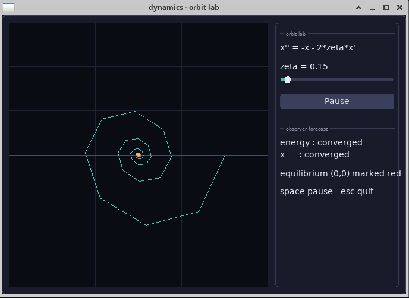
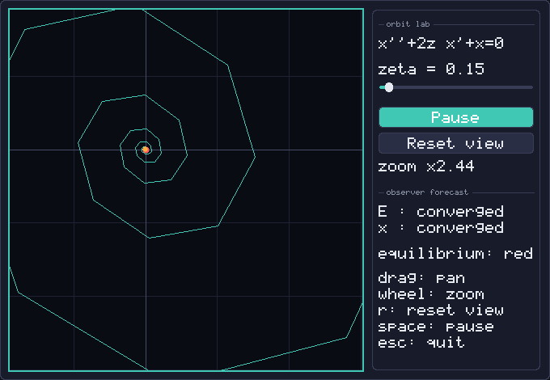
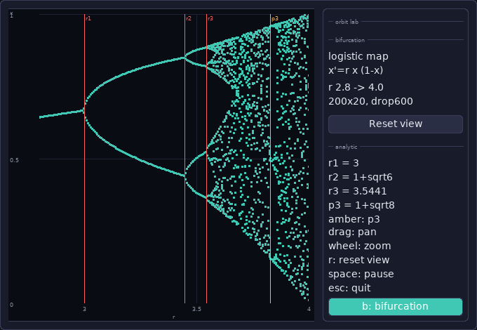

# dynamics

[](https://github.com/InauguralSystems/dynamics/actions/workflows/test.yml)
[](https://securityscorecards.dev/viewer/?uri=github.com/InauguralSystems/dynamics)
[](https://github.com/InauguralSystems/dynamics/tags)
[](LICENSE)

An **observer-rich dynamical-systems lab** in [EigenScript](https://github.com/InauguralSystems/EigenScript).

Most EigenScript code is observer-*sparse*: the convergence/stability/oscillation
predicates and temporal `prev` show up rarely, because the usual domains (parsers,
stores, games, emulators) don't need them. `dynamics` deliberately lives where the
observer is **load-bearing** — systems that *seek an equilibrium* — so its code
exercises `loop while not converged`, the six windowed predicates
(`converged` / `stable` / `improving` / `oscillating` / `diverging` /
`equilibrium`), and temporal history *authentically*, not as decoration.

## Why it exists

Two jobs:

1. **Forcing function.** The windowed-predicate semantics were rebuilt in the
   EigenScript runtime but have no heavy real consumer to battle-test them across
   their full range — the settling `improving∧stable` gray band, the limit cycle
   (`stable` amplitude ∧ `oscillating` phase), spurious `converged` on numerical
   jitter. A damped oscillator sweeps that whole space; this package is the
   consumer that stresses it and surfaces gaps upstream.

2. **Corpus source.** A measurement of the
   [iLambdaAi](https://github.com/InauguralSystems/iLambdaAi) training corpus found
   the observer idioms at noise level (~0.08%) — the model was learning a
   conventional language, not the observer-centric one that *is* EigenScript. The
   other ecosystem repos are observer-deserts. This package is dense, authentic
   observer usage to fill that gap.

Every member is **runtime-verified** (it parses and runs; CI imports it the way a
consumer would). The runtime — not a human — certifies the code, which keeps the
no-oracle discipline: this is verified training data, not a hand-authored notion of
"good" observer code.

## Surface (0.1.0 seed)

```eigenscript
import dynamics

dynamics.relax of [0.0, 0.5, 100.0]   # geometric relaxation to a target; observer decides convergence
dynamics.settle_steps of 0.8          # iterations to converge (no fixed tolerance constant)
dynamics.last_delta of 0.5            # final pre-convergence step, read via temporal `prev`
dynamics.VERSION
```

`dynamics.eigs` is the importable package facade (the 0.1.0 relaxation primitive).
The lab itself is a set of standalone runnable programs (corpus specimens +
forcing functions), each exercising a different observer sub-surface:

- **physics** (`physics.eigs`) — **built.** The damped-oscillator ζ-sweep: the
  predicate showcase. Observes energy (Lyapunov → `improving`/`converged`) and
  displacement (`oscillating`) of the *same* system; the damping ratio sweeps the
  full predicate space, and the ζ=0 row shows the founding-question lesson —
  energy conserved (never converges) while x oscillates, opposite verdicts set by
  what the observer watches. Run: `eigenscript physics.eigs`.
- **life** (`life.eigs`) — **built.** Conway's Game of Life: the temporal
  showcase. A blinker, a block, and a glider all have constant population, so
  `report of population` calls all three the same — only comparing the board to its
  own past (a position-sensitive signature + `prev`) reveals period-2 oscillator
  vs. still life vs. translating. The temporal observer doing what the scalar
  predicate cannot. Run: `eigenscript life.eigs`.
- **solve** (`solve.eigs`) — **built.** Jacobi / Gauss-Seidel / power iteration /
  PageRank: the loop-idiom showcase. Every loop runs until `report of change` is
  settled (and holds) — the observer, not a magnitude tolerance, decides "done".
  Gauss-Seidel converges in fewer iterations than Jacobi under the *same* idiom;
  PageRank's oscillatory residual needs the debounce. Run: `eigenscript solve.eigs`.

- **orbit lab** (`orbit_main.eigs`) — **built** (fleet UI ladder rung 1,
  [#20](https://github.com/InauguralSystems/dynamics/issues/20)). A themed
  lib/ui window over the *unmodified* `physics.eigs` core: live phase portrait
  of the damped oscillator (analytic equilibrium at the origin, marked), a ζ
  slider, pause/resume, **pan/zoom** (drag the plot, wheel to zoom, `r` or the
  button to reset), and the observer's live regime forecasts for energy and
  displacement. The UI is a **pure reader** of the simulation —
  `tests/test_orbit_oracle.sh` byte-diffs a headless run against a UI-stepped
  run of the same system (and plants a fault to prove the diff can fail), and
  runs it again with the view panned and zoomed on *every frame*: the
  trajectory must still be byte-identical, which is what makes "the view is
  display-only" a checked claim rather than a comment. That the controls
  actually respond is a separate question, answered by
  `tests/test_orbit_mouse.sh` — real xdotool input into the real window,
  verified by decoding the rendered pixels.
  The window has a **second view** — press `b` or the toggle at the foot of
  the control column — showing the bifurcation diagram of the logistic map
  (below). Same window, same theme, same app loop; the phase portrait is what
  it opens on, so nothing above changed.
  Run: `eigenscript orbit_main.eigs` (needs a gfx-capable build: `make gfx`
  in the EigenScript repo). Palette lives in `orbit_theme.eigs`
  (DeslanStudio in-place theme-apply pattern).



Zoomed in on the equilibrium (same session, view state only — the trajectory
is untouched):



- **logistic map / bifurcation view** (`logistic.eigs` + the orbit lab's second
  view) — **built** (fleet UI ladder rung 1, slice 3). The damped oscillator is
  **linear**: it has no bifurcation to draw, and neither does anything else in
  this repo, so rather than fake a diagram the lab gained the standard system
  that does — `x -> r x (1 - x)`. It is here because its cascade is *known*,
  which makes the picture checkable: `tests/test_bifurcation.sh` compares the
  plotted period-1 and period-2 branches against the closed forms `1 - 1/r` and
  `(r+1 ± sqrt((r-3)(r+1)))/(2r)` (they agree to **8e-16**), locates the
  doublings by bisection and puts them on `r = 3`, `r = 1 + sqrt(6)` and
  `r = 3.5440903` to within 3e-4, recovers the first Feigenbaum ratio as
  **4.7502** (true 4.7514), and pins the period-3 window opening exactly at
  `r = 1 + sqrt(8)`. The four vertical markers on the plot are drawn where that
  algebra says they are — the pitchfork lands on the line, it is not fitted to
  it. This is the first production consumer of lib/ui's x-y `chart` widget
  (EigenScript#819), which closed FINDINGS F-DYN-9/F-DYN-10.



  The sweep is 200 parameter columns x 20 asymptotic samples = 4,000 points,
  after discarding 600 transient iterations — deliberately modest, because the
  widget costs ~24 µs per point per frame and more columns buy resolution, not
  physics.

  **It ships with a memory gate.** `tests/test_bif_mem.sh` runs the real window
  at 30 / 100 / 300 frames under a `ulimit -v` cap and fails on a ceiling
  breach *or* on RSS that grows with the frame count — in the steady-state
  shape and in a toggle-the-view-every-frame shape, which pins that N view
  switches cost exactly one sweep, one series and four markers. It is validated
  by two planted faults. This is not decoration: the first working build of
  this view grew **3.9 MB per frame** and died at 859 MB, and every correctness
  oracle stayed green the whole time. The cause was a runtime bug, not the
  sweep — see FINDINGS F-DYN-13 / EigenScript#827, fixed upstream in v0.35.1.
  That fix retired one of the planted faults (the bug it recreated no longer
  reproduces), so the fault was re-pointed at a per-frame retention leak rather
  than dropped: a gate validated by one fewer fault is a gate that has quietly
  stopped discriminating.

Forcing-function findings (runtime gaps surfaced while building) are logged in
[FINDINGS.md](FINDINGS.md) — most have graduated to upstream fixes
(#255/#256/#280/#375, and #819/#820 which closed the two lib/ui plot gaps);
a calling-convention edge remains open, and building this rung surfaced two
more: EigenScript#827 (unbounded temporal assignment history — the one that
froze a box, fixed by #829 and shipped in v0.35.1, the pin this repo runs) and
#828 (chart render allocation).

## Develop locally

```sh
eigenscript dynamics.eigs            # parse + run the entry point
bash tests/test_lint.sh              # --lint clean across every .eigs in the repo
bash tests/test_smoke.sh             # stage as a consumer would and import
bash tests/test_lab.sh               # run the standalone lab programs
bash tests/test_orbit_hist.sh        # trajectory history: bounded live, complete on dump
bash tests/test_bifurcation.sh       # bifurcation oracle: plotted data vs closed-form algebra
bash tests/test_orbit_oracle.sh      # UI oracle: headless vs UI-stepped byte-diff
bash tests/test_orbit_mouse.sh       # mouse + render-decode oracle (real input, real pixels)
bash tests/test_bif_mem.sh           # memory gate: peak RSS capped and flat in frame count
```

Every one of those that can fail silently is validated with a **planted fault**
— a deliberately broken copy that the checker must reject — so a green run is
evidence the checker still discriminates, not just that nothing threw.

CI builds EigenScript from source on Linux (the gfx variant, under Xvfb) and runs
every one of those scripts on every push and PR (see
`.github/workflows/test.yml`).

## Publish

A "publish" is a git tag; consumers pin against tags ([semver](https://semver.org/)).

```sh
git tag v0.1.0 && git push --tags
```

## Consume

```sh
eigenscript --pkg add InauguralSystems/dynamics https://github.com/InauguralSystems/dynamics v0.1.0
```
